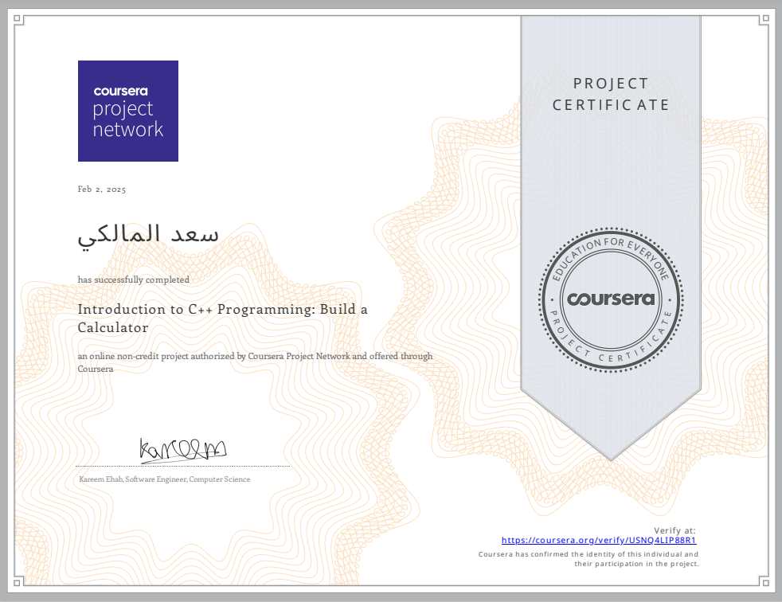

# Simple Calculator

## Info
This project is simple calculator built in C++ Language for coursera project [Project link](https://www.coursera.org/projects/introduction-to-cpp-programming-build-a-calculator)

## Code
```C++
#include <iostream>
#include <cmath>
using namespace std;

int main() {
    int operation; // العمليات الحسابية
    int num1; 
    int num2;
    double result; // الناتج ووضعناه دبل لكي تظهر النتائج بشكل أفضل مع الكسور

    cout << "Enter first number : ";
    cin >> num1;
    cout << "Enter second number : ";
    cin >> num2;

    cout << "1-Sum" << endl;
    cout << "2-Subtraction" << endl;
    cout << "3-Multiplication" << endl;
    cout << "4-Division" << endl;
    cout << "Choose operation: ";
    cin >> operation;

    switch (operation) {
        case 1:
            result = num1 + num2;
            cout << "Result (Sum) = " << result << endl;
            break;
        case 2:
            result = num1 - num2;
            cout << "Result (Subtraction) = " << result << endl;
            break;
        case 3:
            result = num1 * num2;
            cout << "Result (Multiplication) = " << result << endl;
            break;
        case 4:
            if (num2 != 0) {
                result = static_cast<double>(num1) / num2;
                cout << "Result (Division) = " << result << endl;
            } else {
                cout << "Error: Division by zero is not allowed." << endl;
                return 1; // عدم قبول القسمة على صفر لأنها عملية غير منطقية في الرياضيات
            }
            break;
        default:
            cout << "Invalid operation! Please enter a number between 1 and 4." << endl;
            return 1; // خروج بسبب اختيار خاطئ
    }

    return 0;
}

```
## My Verify
[Link of Certificate](https://www.coursera.org/account/accomplishments/verify/USNQ4LIP88R1)



### By : Saad Almalki


